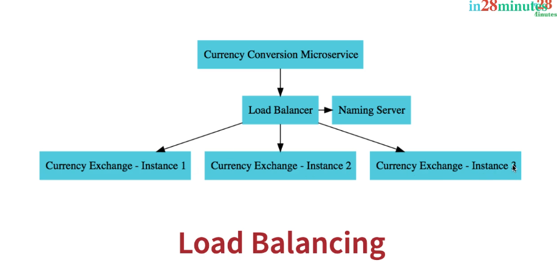
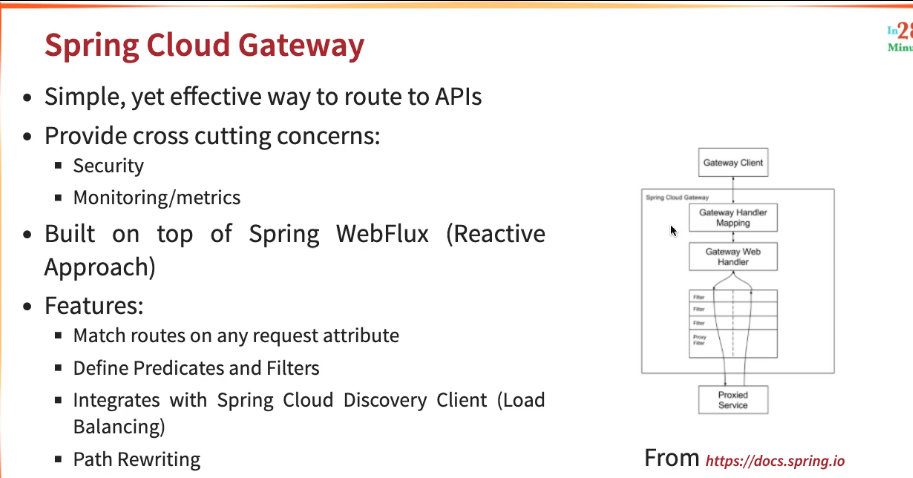
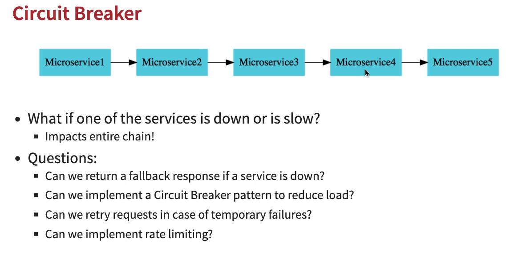

Feign is a declarative web service client. It makes writing web service clients easier.
"Eureka," "Feign," and "LoadBalancer" are terms commonly associated with microservices architecture and are often used in conjunction with each other, especially within the Spring Cloud ecosystem. Here's an overview of each term and their roles in microservices:

1. **Eureka**:
    - **What is Eureka?** Eureka is a service registry and discovery server that helps microservices find and communicate with each other within a distributed system. It is part of Netflix's open-source stack and is widely used in microservices architectures.
    - **How Does Eureka Work?** Eureka allows microservices to register themselves with the server as they start up. It maintains a registry of available services and their instances. Other services can query Eureka to discover the locations (host and port) of the services they need to communicate with.
    - **Role in Microservices**: Eureka is crucial for service discovery, allowing microservices to locate and interact with one another dynamically.

2. **Feign**:
    - **What is Feign?** Feign is a declarative HTTP client for microservices. It simplifies making HTTP requests to other microservices by allowing developers to define API interfaces using annotations. Feign handles the HTTP requests and responses transparently.
    - **How Does Feign Work?** Developers define interfaces with annotations specifying the target service and the HTTP methods. Feign generates the necessary HTTP requests based on these interfaces, making it easier to call remote microservices.
    - **Role in Microservices**: Feign simplifies the process of making HTTP requests between microservices, reducing boilerplate code and making it more convenient to communicate with other services.

3. **LoadBalancer**:
    - **What is Load Balancing?** Load balancing is a technique used to distribute incoming network traffic across multiple servers or instances to ensure high availability, improved performance, and fault tolerance.
    - **How Does Load Balancing Work?** In the context of microservices, load balancers distribute requests among multiple instances of a service to evenly distribute the load. Load balancers can use various algorithms to determine how to route requests, such as round-robin, least connections, or based on server health.
    - **Role in Microservices**: Load balancers are essential for achieving scalability and fault tolerance in a microservices architecture. They ensure that requests are evenly distributed among service instances, preventing overloading of any single instance and providing redundancy.

In a typical microservices setup, these components work together:

- Eureka helps microservices discover each other and obtain their network locations.
- Feign simplifies the process of making HTTP requests to other microservices, using Eureka to locate those services.
- Load balancers distribute incoming requests among multiple instances of a service to ensure efficient utilization and high availability.

Together, these components play a vital role in creating a scalable, fault-tolerant, and easily maintainable microservices architecture. They help in service discovery, communication, and load distribution within the system.

## Spring Cloud Gateway - API Gateway

Certainly! Here are four of the top features of Spring Cloud Gateway:

1. **Dynamic Routing**:
    - Spring Cloud Gateway allows for dynamic routing based on various criteria such as URI path, headers, query parameters, and more. This flexibility enables sophisticated routing scenarios, such as traffic splitting, A/B testing, and blue-green deployments.

2. **Filters and Interceptors**:
    - Filters and interceptors provide a powerful way to manipulate and customize incoming requests and outgoing responses. You can implement custom filters to perform tasks like authentication, authorization, request/response transformation, logging, and rate limiting.

3. **Service Discovery Integration**:
    - Spring Cloud Gateway seamlessly integrates with service discovery solutions like Netflix Eureka and HashiCorp Consul. This enables automatic discovery of backend services, making it easier to maintain and scale microservices-based architectures.

4. **Load Balancing**:
    - Load balancing is a critical feature for distributing incoming requests across multiple instances of backend services to ensure scalability and fault tolerance. Spring Cloud Gateway offers built-in support for load balancing, allowing you to configure strategies like round-robin, weighted, or custom load balancing algorithms.

These features make Spring Cloud Gateway a versatile and robust API gateway solution for building, managing, and securing microservices-based applications. It empowers developers to implement complex routing scenarios and apply various filters and policies to control the behavior of their API traffic effectively.

# Resilience4j

Fault tolerance, earlier (Hystrix), Circuit breaker, rate limiter, retry

Circuit Breaker https://resilience4j.readme.io/docs/circuitbreaker

# Monitoring vs Observability vs OpenTelemetry

SB2 uses Sleuth (only traces) > Brave (Tracer Lib) > Zipkin
SB3 uses Micrometer (logs, metrics & traces) > OpenTelemetry > Zipkin